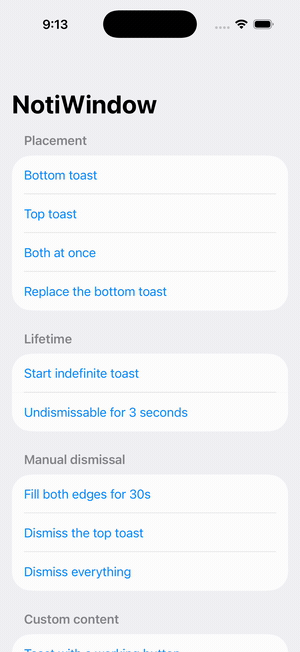

# NotiWindow

Toasts that render above everything — including sheets — in a dedicated passthrough
window, while the app underneath stays fully usable.

<p align="center">
  
</p>

## Why

A toast built with `.overlay` lives inside the view hierarchy, so anything presented
above that hierarchy covers it. The usual workaround is attaching another toast host
inside every sheet. NotiWindow hosts toasts in their own `UIWindow` at
`windowLevel = .alert + 1`, so there is exactly one host and nothing covers it.

## Requirements

iOS 18.6+. No dependencies.

## Install

```swift
.package(url: "https://github.com/jstnf/NotiWindow", from: "1.0.0")
```

## Use

Attach the window once at your app root, holding the center yourself so non-view
code can present too:

```swift
@main
struct MyApp: App {
    @State private var center = NotiCenter()

    var body: some Scene {
        WindowGroup {
            RootView()
                .notiWindow(center)
        }
    }
}
```

Present from anywhere:

```swift
center.present(.bottom) {
    NotiToast("Saved", systemImage: "checkmark.circle.fill", tint: .green)
}
```

Any view works, not just `NotiToast`:

```swift
center.present(.top, duration: .seconds(5)) {
    HStack {
        ProgressView()
        Text("Uploading…")
    }
    .padding()
    .background(.regularMaterial, in: Capsule())
}
```

Indefinite toasts dismiss by token:

```swift
let token = center.present(.top, duration: .indefinite) {
    NotiToast("Syncing…")
}
// later
center.dismiss(token)
```

A token proves a toast was presented, not that it still is — it may have expired, been
tapped or swiped away, or been replaced by something else on the same edge. Ask the center
rather than assuming:

```swift
if center.isPresented(token) { … }   // or center.isPresented(.top)
```

Reading that inside a view body tracks it, so UI derived from it updates when the toast
goes away, whatever made it go.

Inside views, reach the center through the environment:

```swift
@Environment(\.notiCenter) private var center
```

Views below a `.notiWindow(_:)` find that modifier's center. Views without one find a
shared default that renders nowhere — presenting into it warns in debug builds.

If every caller reaches the center through the environment, `.notiWindow()` with no
argument will make and own one for you.

## Behavior

- **Two independent slots.** Top and bottom each hold one toast, and can be occupied
  at the same time. Presenting on an occupied edge replaces its occupant, and the
  replacement slides in rather than snapping — even mid-drag, where the incoming
  toast arrives at rest instead of inheriting the outgoing one's offset.
- **Dismissal.** Tap and swipe-toward-its-own-edge are both on by default; disable
  either per call with `dismissOnTap:` / `dismissOnSwipe:`. A swipe that stops short
  of the dismissal threshold springs back. `dismiss(_:)` takes either a token or an
  edge, and `dismissAll()` clears both edges; dismissing one edge leaves the other
  alone.
- **Reduce Motion.** Slide transitions collapse to a fade automatically.
- **Passthrough.** Touches outside a toast reach the app untouched — including while
  a toast is up over a sheet. Buttons inside a toast work normally.
- **Multi-window.** One center can drive several scenes at once; each window keeps its
  own record of where its toasts are. Window geometry changing underneath a toast —
  rotation, Split View, Stage Manager, or an interactive resize — makes that window
  pass touches through until its toasts report where they landed, so the app below
  never stops responding.
- **A center is the unit of sharing.** A center owns *which* toast is up, so every
  window driven by the same center shows the same toast, and dismissing it in one
  dismisses it everywhere. That is the point when the message belongs to the app —
  "You're offline" should not appear in one window only. When a toast belongs to the
  window that raised it — "Saved to your list" — give each scene its own center:

  ```swift
  WindowGroup {
      RootView().notiWindow()   // a center per window
  }
  ```

  `notiWindow()` makes and owns one per scene. `notiWindow(_:)` uses the center you
  hand it, so a center held on your `App` is shared by every window in the group.

## Contributing

See [CONTRIBUTING.md](CONTRIBUTING.md) for how to build, test, and lint the package.

## License

MIT
